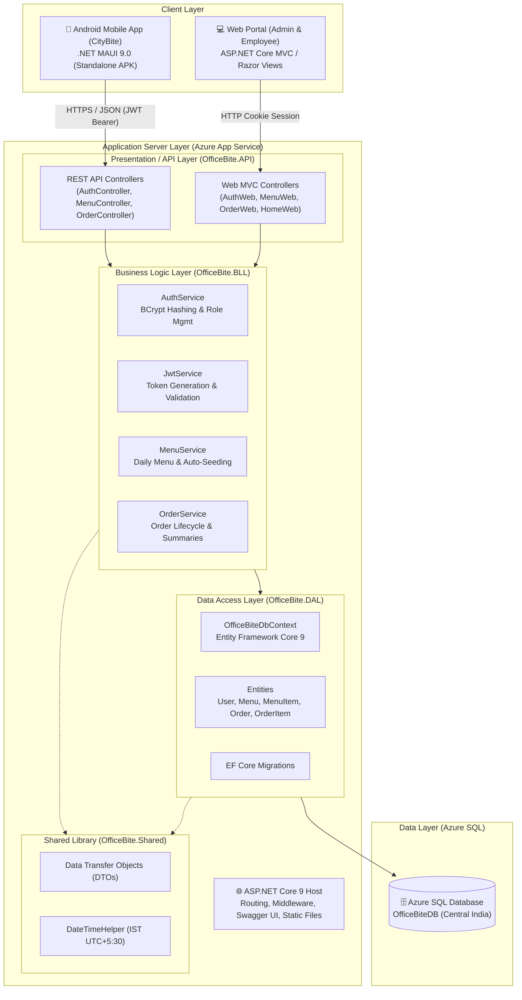
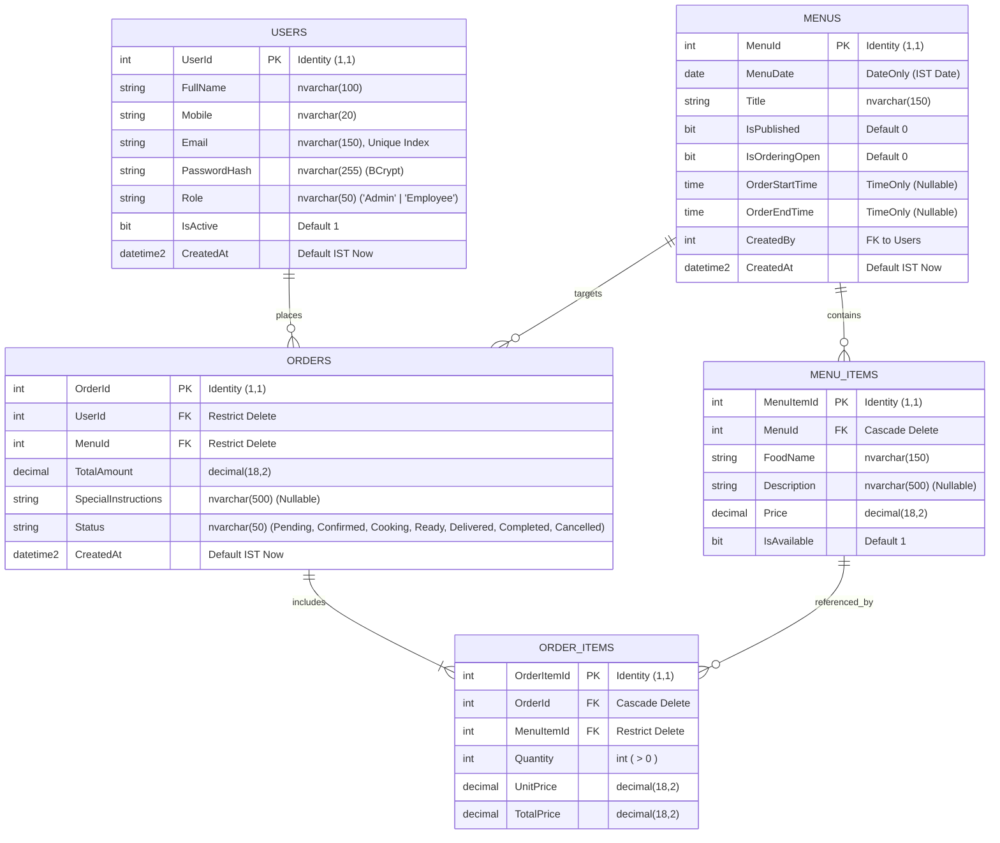
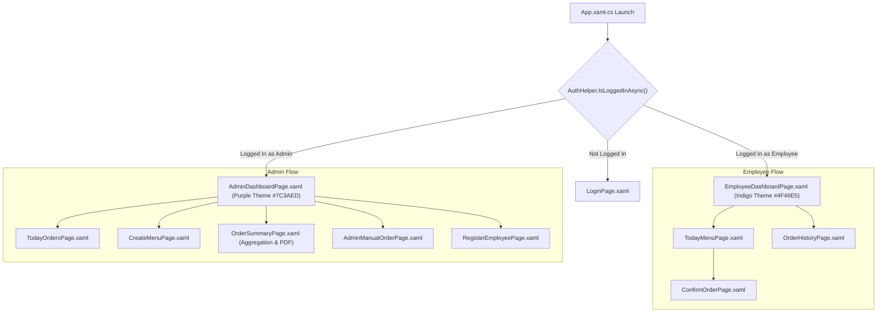
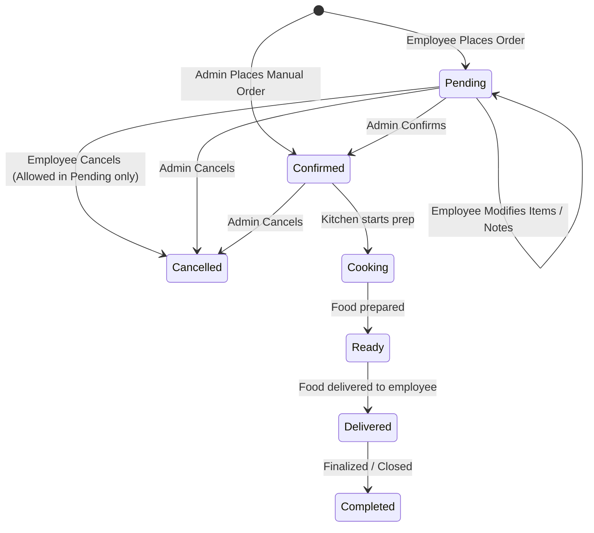

# OfficeBite (CityBite) — System Architecture & Developer Guide

Comprehensive technical documentation and architectural reference for the **OfficeBite** food ordering platform, covering the **ASP.NET Core Web Portal & REST API**, the **.NET MAUI Android Mobile Application (CityBite)**, the **Database Schema**, business workflows, and deployment lifecycles.

---

## 1. High-Level Architecture Overview

OfficeBite is an enterprise food ordering and canteen management system built using modern Microsoft .NET 9 technologies. It provides seamless daily lunch/meal ordering for employees, kitchen preparation management for canteen staff, and administrative management capabilities.



---

## 2. Solution Structure & Repository Layout

```
e:/Tapa/APK/
├── CityBite.apk                       # Compiled Standalone Android APK (Release)
├── OfficeBite.apk                     # Backup/Archive Android APK
├── deploy-to-phone.bat                # Automated ADB build & wireless deploy script
├── run-api.bat                        # Local development runner for Backend API
├── serve-apk.ps1                      # Lightweight PowerShell HTTP server for APK downloads
│
├── OfficeBite/                        # Backend Solution (Web + API + BLL + DAL + Shared)
│   ├── OfficeBite.sln                 # Visual Studio Solution file
│   ├── ARCHITECTURE.md                # Solution Architecture & Developer Guide
│   ├── Dockerfile                     # Multi-stage Docker build configuration
│   │
│   ├── OfficeBite.API/                # API & Web Host (ASP.NET Core 9.0)
│   │   ├── Controllers/               # REST API & Web MVC Controllers
│   │   │   ├── AuthController.cs      # Mobile REST Auth Endpoints
│   │   │   ├── AuthWebController.cs   # Web Cookie-based Auth & Quick-Login
│   │   │   ├── MenuController.cs      # Mobile REST Menu Endpoints
│   │   │   ├── MenuWebController.cs   # Web Menu Management & Ordering Views
│   │   │   ├── OrderController.cs     # Mobile REST Order & Status Endpoints
│   │   │   ├── OrderWebController.cs  # Web Orders, Manual Order & Summaries
│   │   │   └── HomeWebController.cs   # Web Landing/Redirection Controller
│   │   ├── Views/                     # Razor Views for Web Portal
│   │   │   ├── AuthWeb/               # Login, Register, Employee management
│   │   │   ├── MenuWeb/               # Today's Menu & Order placement views
│   │   │   ├── OrderWeb/              # Order Lists, Manual Order, Today's Summary
│   │   │   ├── Shared/                # _Layout.cshtml, Navigation bars, Footers
│   │   │   └── HomeWeb/               # Home Landing view
│   │   ├── wwwroot/                   # Static CSS, JS, Bootstrap, Icons
│   │   ├── Program.cs                 # App Startup, DI, JWT, Swagger, Auto-migrations
│   │   ├── appsettings.json           # Connection strings, JWT settings, Logging
│   │   └── OfficeBite.API.csproj      # .NET 9 Web SDK project file
│   │
│   ├── OfficeBite.BLL/                # Business Logic Layer (.NET 9)
│   │   ├── Services/
│   │   │   ├── AuthService.cs         # Registration, Validation, Role elevation
│   │   │   ├── JwtService.cs          # Security token generator
│   │   │   ├── MenuService.cs         # Menu CRUD, Standard Menu auto-seeding (19 dishes)
│   │   │   └── OrderService.cs        # Order processing, status workflow, aggregations
│   │   └── OfficeBite.BLL.csproj
│   │
│   ├── OfficeBite.DAL/                # Data Access Layer (.NET 9 + EF Core 9)
│   │   ├── Data/
│   │   │   └── OfficeBiteDbContext.cs # EF Core DbContext, Fluent API & Relationships
│   │   ├── Entities/                  # Domain Models (User, Menu, MenuItem, Order, OrderItem)
│   │   ├── Migrations/                # Version-controlled DB migrations
│   │   └── OfficeBite.DAL.csproj
│   │
│   └── OfficeBite.Shared/             # Shared DTOs & Cross-cutting Utilities
│       ├── DTOs/                      # Request/Response payloads (16 contracts)
│       ├── Helpers/
│       │   └── DateTimeHelper.cs      # Centralized Indian Standard Time (IST) utility
│       └── OfficeBite.Shared.csproj
│
├── OfficeBite.Mobile/                 # Cross-platform Mobile App (.NET MAUI 9.0)
│   ├── OfficeBite.Mobile.sln          # Mobile Solution file
│   ├── OfficeBite.Mobile.csproj       # Android net9.0-android target & Standalone APK flags
│   ├── MauiProgram.cs                 # Dependency Injection & Cloud API HttpClient config
│   ├── App.xaml / App.xaml.cs         # Application entrypoint & Auto-Login routing logic
│   ├── Helpers/
│   │   ├── AuthHelper.cs              # SecureStorage wrapper for Token, UserId, Role
│   │   ├── DateTimeHelper.cs          # Mobile IST Date/Time Formatter
│   │   └── PdfReportHelper.cs         # Native Android Canvas PDF generator for summaries
│   ├── Models/                        # Mobile request & response models
│   ├── Services/
│   │   └── ApiService.cs              # HTTP Client for REST endpoints + Bearer auth
│   └── Views/                         # 11 MAUI XAML Pages
│       ├── LoginPage.xaml             # Mobile Sign In screen
│       ├── RegisterEmployeePage.xaml  # Account Registration screen
│       ├── EmployeeDashboardPage.xaml # Employee dashboard (Menu, Today's Order, History)
│       ├── TodayMenuPage.xaml         # Live menu browsing & item selection
│       ├── ConfirmOrderPage.xaml      # Order cart review & special instructions
│       ├── OrderHistoryPage.xaml      # Employee personal past orders
│       ├── AdminDashboardPage.xaml    # Admin live KPI summary & real-time orders feed
│       ├── CreateMenuPage.xaml        # Menu creation, item editor & availability toggle
│       ├── TodayOrdersPage.xaml       # Full list of today's placed orders
│       ├── OrderSummaryPage.xaml      # Aggregated food quantity breakdown + PDF Export
│       └── AdminManualOrderPage.xaml  # Admin manual order placement for employees/guests
│
└── OfficeBiteDB/                      # Database Scripts & Schema Backups
    └── OfficeBiteDB.sql               # Full SQL Server schema and table definitions
```

---

## 3. Database Architecture & Data Model

The database runs on **Azure SQL Database** (Server: `citytechbiteserver.database.windows.net`, Database: `OfficeBiteDB`). It uses Entity Framework Core 9 with code-first migrations.



### Key Schema Constraints & Design Rules:
1. **Email Uniqueness**: `Users.Email` has a unique index.
2. **Cascade Behavior**: Deleting a `Menu` cascades to its `MenuItems`. Deleting an `Order` cascades to its `OrderItems`.
3. **Delete Restrictions**: Deleting a `User` or `Menu` is restricted (`OnDelete(DeleteBehavior.Restrict)`) if associated `Orders` exist, preventing historical order loss.
4. **Precision**: All financial fields (`Price`, `UnitPrice`, `TotalPrice`, `TotalAmount`) are enforced to `decimal(18,2)`.

---

## 4. Backend & Web Architecture

### 4.1 Hybrid Architecture (API + MVC)
The backend project (`OfficeBite.API`) operates in a dual mode:
- **REST Web API (`/api/...`)**: Consumed by the MAUI mobile application, authenticated via standard HTTP `Authorization: Bearer <JWT>` headers.
- **Server-Side Rendered Web Portal (`/web/...` and `/`)**: Consumed by desktop/mobile web browsers, authenticated via HTTP cookies (`UserRole`, `UserName`, `UserId`, `AuthToken`).
- **Swagger Documentation (`/swagger`)**: Interactive OpenAPI specification documentation for API discovery and testing.

### 4.2 Auto-Seeding & Resilience Engine
- **Standard Menu Auto-Seed**: When employees or admins open the app/web for the day, if no menu exists for the current IST date, `MenuService.AutoSeedTodayMenuAsync` automatically generates a published lunch menu with the **19 standard dishes**:
  1. Fish Thali (Rs.80)
  2. Paneer Butter (Rs.50)
  3. Subin2paz (Rs.40)
  4. Vagturka (Rs.35)
  5. Chicken Ragla 2 Pes (Rs.80)
  6. Egg Cari (Rs.20)
  7. Plow (Rs.60)
  8. Aluporata + Chughni (Rs.30)
  9. Roti (Rs.5)
  10. Egg (Rs.10)
  11. Egg Turka (Rs.45)
  12. Tok Dahi (Rs.10)
  13. Bananna (Rs.5)
  14. Vagmills (Rs.50)
  15. Egg Thali (Rs.60)
  16. Khichuri (Rs.40)
  17. Chawmin Egg (Rs.50)
  18. Moglai (Rs.170)
  19. Piara (Rs.15)
- **Automatic Admin Role Verification**: `AuthService.EnsureAdminUsersAsync()` executes at startup, verifying admin accounts and promoting designated admins automatically.
- **Database Auto-Migration**: `Program.cs` executes `db.Database.Migrate()` on boot, preventing database schema drift.

### 4.3 REST API Endpoints Reference

| Module | Method | Route | Authorization | Description |
|---|---|---|---|---|
| **Auth** | `POST` | `/api/Auth/register` | Anonymous | Register a new Employee account |
| **Auth** | `POST` | `/api/Auth/login` | Anonymous | Authenticate and retrieve JWT token + User info |
| **Auth** | `GET` | `/api/Auth/employees` | Bearer Token | Retrieve all active employees for selection |
| **Menu** | `GET` | `/api/Menu/today` | Bearer Token | Get today's published active menu items for employees |
| **Menu** | `GET` | `/api/Menu/admin/today` | Admin | Get full today's menu (active + inactive items) |
| **Menu** | `POST` | `/api/Menu` | Admin | Create a new daily menu |
| **Menu** | `POST` | `/api/Menu/{id}/items` | Admin | Add new dishes to an existing menu |
| **Menu** | `PUT` / `POST` | `/api/Menu/items/{id}` | Admin | Edit food name, price, description, availability |
| **Menu** | `PATCH` / `POST` | `/api/Menu/items/{id}/toggle-availability` | Admin | Toggle dish availability on/off instantly |
| **Menu** | `POST` | `/api/Menu/{id}/publish` | Admin | Publish menu to make it visible to employees |
| **Menu** | `POST` | `/api/Menu/{id}/close` | Admin | Close ordering window for the day |
| **Menu** | `POST` | `/api/Menu/admin/reset-standard` | Admin | Reset today's menu to standard 19 items |
| **Order** | `POST` | `/api/Order` | Bearer Token | Place a new meal order for current user |
| **Order** | `PUT` / `POST` | `/api/Order/{id}` | Bearer Token | Modify a `Pending` order |
| **Order** | `DELETE` / `POST` | `/api/Order/{id}` | Bearer Token | Cancel/Delete a `Pending` order |
| **Order** | `GET` | `/api/Order/my-orders` | Bearer Token | Retrieve order history for current logged-in user |
| **Order** | `GET` | `/api/Order/admin/today` | Admin | List all employee orders placed for today |
| **Order** | `GET` | `/api/Order/admin/today-summary` | Admin | Get aggregated count, revenues & dish quantities |
| **Order** | `PUT` / `POST` | `/api/Order/admin/{id}/status` | Admin | Update status (`Pending`, `Confirmed`, `Cooking`, `Ready`, `Delivered`, `Cancelled`) |
| **Order** | `POST` | `/api/Order/admin/manual` | Admin | Create manual order on behalf of employee/guest |

---

## 5. Mobile App Architecture (.NET MAUI)

The mobile application **CityBite** is designed as a native Android application using `.NET MAUI 9.0`.



### 5.1 Key Mobile Architecture Highlights:
1. **Auto-Login & Role-Based Navigation**:
   - `AuthHelper` securely stores the JWT, User ID, Full Name, Email, and Role in Android's `SecureStorage` (EncryptedSharedPreferences).
   - On launch, `App.xaml.cs` automatically detects session validity and redirects to the appropriate dashboard without requiring manual login.
2. **Resilient Network Client (`ApiService.cs`)**:
   - Automatically injects `Authorization: Bearer <Token>` on all requests.
   - Handles network timeouts (60-second threshold) and fallback method routing (supports both `PUT`/`PATCH`/`DELETE` and `POST` fallbacks for maximum proxy compatibility).
3. **Native Android Canvas PDF Generator (`PdfReportHelper.cs`)**:
   - Uses Android's low-level `Android.Graphics.Pdf.PdfDocument` and `Android.Graphics.Canvas` to generate paginated, high-resolution A4 PDF reports of the day's order summaries, food breakdowns, and employee distribution.
   - Includes automatic page-break calculations, table rendering, badges, and Android native file sharing via `Share.RequestAsync`.
4. **Standalone Packaging Configuration**:
   - In `OfficeBite.Mobile.csproj`, `<AndroidUseSharedRuntime>false</AndroidUseSharedRuntime>` and `<EmbedAssembliesIntoApk>true</EmbedAssembliesIntoApk>` ensure the generated APK contains all necessary .NET runtimes, enabling it to run standalone on any Android device without Visual Studio debugging tools.

---

## 6. Timezone & Business Logic Workflow

### 6.1 Indian Standard Time (IST UTC+5:30) Enforcement
Because the cloud backend is hosted on Azure servers which may operate on UTC or alternate server timezones, all business operations enforce **Indian Standard Time (IST)** using `DateTimeHelper`:
- `DateTimeHelper.NowIst`: Computes `TimeZoneInfo.FindSystemTimeZoneById("India Standard Time")` with UTC fallback.
- `DateTimeHelper.TodayIst`: Computes `DateOnly.FromDateTime(NowIst)`.
- All daily menus, order cuts, and summary reports are strictly partitioned by the IST date.

### 6.2 Order Lifecycle State Machine



- **Employee Edit Window**: Employees can modify or cancel their orders only while the status is `Pending`. Once the Admin/Kitchen moves the status to `Confirmed` or `Cooking`, the order is locked.
- **Admin Price Override & Custom Dishes**: In `AdminManualOrderPage.xaml` and `OrderService.CreateAdminManualOrderAsync`, Admins can create orders for unlisted food items or override default prices per dish.

### 6.3 1:00 PM IST Ordering Cutoff & Escalation
- **Strict 1:00 PM Cutoff**: Daily lunch ordering automatically closes at **1:00 PM IST** (`DateTimeHelper.OrderCutoffTime = 13:00`).
- **Employee Enforcement**: If an employee attempts to place, modify, or cancel an order after 1:00 PM IST via the Web Portal or Mobile App (CityBite), the action is blocked and displays:
  > **"Time is Over, Call Sanjeeb"**
- **Admin Manual Override**: Admins (Sanjeeb) retain full capability via the Admin Manual Order feature (`AdminManualOrderPage.xaml` and `/web/orders/manual`) to take and place late orders on behalf of employees who call.

---

## 7. Build, Run, & Deployment Guide

### 7.1 Running Backend API Locally
Run the helper script:
```cmd
e:\Tapa\APK\run-api.bat
```
Or via terminal:
```bash
dotnet run --project "e:\Tapa\APK\OfficeBite\OfficeBite.API\OfficeBite.API.csproj" --urls "http://0.0.0.0:5052"
```
- Web Portal: `http://localhost:5052/`
- Swagger UI: `http://localhost:5052/swagger`

### 7.2 Building & Deploying Mobile App to Android Phone
Connect your Android phone via USB (with USB Debugging enabled) or over Wi-Fi (Wireless Debugging):
```cmd
e:\Tapa\APK\deploy-to-phone.bat
```
This script will:
1. Detect or connect to your phone via ADB.
2. Compile `OfficeBite.Mobile.csproj` using `dotnet build -f net9.0-android`.
3. Install the APK directly to the phone.
4. Launch the application immediately.

### 7.3 Building Standalone Release APK
```bash
dotnet publish "e:\Tapa\APK\OfficeBite.Mobile\OfficeBite.Mobile.csproj" -f net9.0-android -c Release -p:AndroidPackageFormat=apk
```
The output APK will be located at:
`e:\Tapa\APK\OfficeBite.Mobile\bin\Release\net9.0-android\com.companyname.officebite.mobile-Signed.apk`

### 7.4 Serving APK Over Local Wi-Fi
To allow employees or testers on the same Wi-Fi network to download the APK directly:
```powershell
powershell -ExecutionPolicy Bypass -File "e:\Tapa\APK\serve-apk.ps1"
```
Users can open `http://<YOUR_LOCAL_IP>:8088/` on their phone browser to download `CityBite.apk`.

### 7.5 Production Docker Build
To build and run the backend inside Docker:
```bash
cd e:\Tapa\APK\OfficeBite
docker build -t officebite-api .
docker run -p 8080:8080 -e ConnectionStrings__DefaultConnection="<YOUR_AZURE_SQL_CONNECTION_STRING>" officebite-api
```

---

## 8. Configuration & Environment Variables

Key configuration parameters in `appsettings.json` / Environment Variables:

| Parameter | Key | Description |
|---|---|---|
| **SQL Database** | `ConnectionStrings:DefaultConnection` | ADO.NET connection string to Azure SQL Database |
| **JWT Key** | `Jwt:Key` | 256-bit secret key used to sign and verify authentication tokens |
| **JWT Issuer** | `Jwt:Issuer` | Token issuer identifier (`OfficeBiteAPI`) |
| **JWT Audience** | `Jwt:Audience` | Token audience identifier (`OfficeBiteMobile`) |
| **JWT Expiry** | `Jwt:ExpiryMinutes` | Token validity lifespan in minutes (Default: `1440` = 24 hours) |
| **Cloud Endpoint** | `MauiProgram.cs (BaseAddress)` | Target API URL (`https://citybite-asanhuefgjfjfsag.centralindia-01.azurewebsites.net/`) |

---

## 9. Common Maintenance & Troubleshooting FAQs

### Q1: The mobile app cannot connect to the backend (Network Error).
- Verify the `BaseAddress` in `MauiProgram.cs`. If testing against local PC, ensure your phone and PC are on the same Wi-Fi network and use your PC's LAN IP (e.g. `http://192.168.0.xxx:5052/`).
- If running on Azure, verify that the Azure App Service is running and not stopped due to quota/sleep.

### Q2: Database queries fail with SQL Connection Timeout.
- Check the Azure SQL Firewall settings. Ensure "Allow Azure services and resources to access this server" is enabled and your local IP address is whitelisted in Azure Portal.

### Q3: An employee cannot see today's menu.
- Ensure the menu has been created and published for the current **Indian Standard Time** date.
- Opening the app automatically triggers the Auto-Seed mechanism if no menu exists.

### Q4: An employee cannot edit their order.
- Orders can only be modified if their status is `Pending`. Once an Admin accepts or confirms an order (`Confirmed`, `Cooking`, `Delivered`), items are locked to maintain kitchen order accuracy.

---

*Documentation maintained for OfficeBite / CityBite project.*
